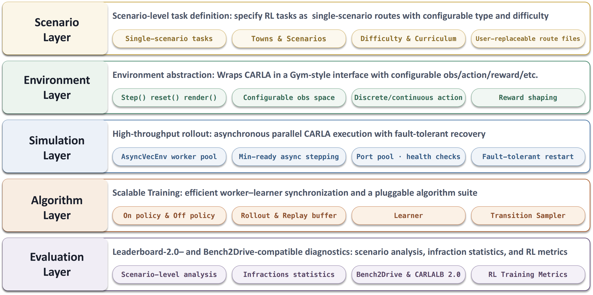
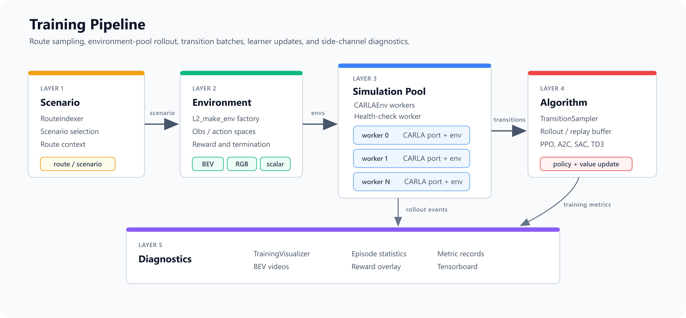
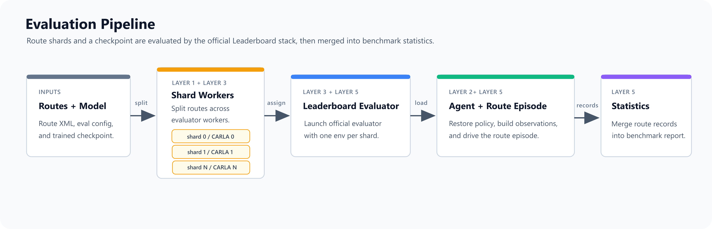

# Architecture Overview

This page gives an overview of the five layers that organize the Bench2Drive-RLInfra codebase. Each layer has a dedicated page with full component descriptions; the **`b2d_rlinfra/framework/`** folder follows the same structure with `L<N>_` names for code-oriented exploration.

| Layer | Responsibility | Detailed page |
|---|---|---|
| **L1 — Scenario** | Route XMLs, task sampling, curriculum, scenario grouping | [Scenario Layer](core_scenarios.md) |
| **L2 — Environment** | Gym-style CARLA interface, wrappers, observations, actions, rewards, termination | [Environment Layer](core_environment.md) |
| **L3 — Simulation** | Asynchronous CARLA worker pool, server management, crash recovery | [Simulation Layer](core_simulation.md) |
| **L4 — Algorithm** | PPO, A2C, SAC, TD3 training, buffers, policies, env adapter | [Algorithm Layer](core_algorithms.md) |
| **L5 — Evaluation** | Leaderboard-compatible runtime, scoring, route diagnostics, videos | [Evaluation and Diagnostics](eval_diagnostics.md) |

To see the async pool lifecycle in action without any training code, try the [Async Pool Tutorial](core_pool_tutorial.md).

---

## How the Layers Connect

The diagrams below show how these abstraction layers compose during training and evaluation. Training moves from task definition, environment construction, and parallel simulation to algorithm updates; evaluation moves from route/checkpoint inputs through the official Leaderboard evaluator loading the RL agent to statistics aggregation.

### Training Pipeline

1. **L1** uses route XMLs and scenario sampling logic to determine the route and scenario context for each episode.
2. **L2** creates one CARLA Gym environment through `L2_make_env`, assembling observation, action, reward, and termination wrappers from configuration.
3. **L3** hosts multiple L2 environment instances in `L3_CARLAEnvPool`; the server manager and health worker handle ports, worker state, and recovery.
4. **L4** uses `L4_EnvAdapter` to preserve worker-indexed async outputs and extract policy observations; PPO / A2C / SAC / TD3 then stack the ready workers, write to the appropriate buffer, and update the policy.
5. **L5** complements the training path with auxiliary outputs such as training videos, episode statistics, and evaluation-compatible metric records.

### Evaluation Pipeline

1. The evaluation launcher reads routes, configuration, and checkpoint paths, splits route shards across workers, and uses `L3_CARLAServerManager` to manage the corresponding CARLA servers.
2. The official Leaderboard evaluator loads `L5_RLLeaderboardAgent`; the agent restores the model and passes it to `L5_LeaderboardEvalRuntime` for closed-loop control.
3. The runtime reuses L2 observation handling and action adaptation logic, converting CARLA world state into policy input and policy output into `VehicleControl`.
4. Per-shard route records are written by the statistics path, then `L5_RLStatisticsManager.merge_results()` aggregates them into a Leaderboard 2.0 / Bench2Drive-compatible report.
