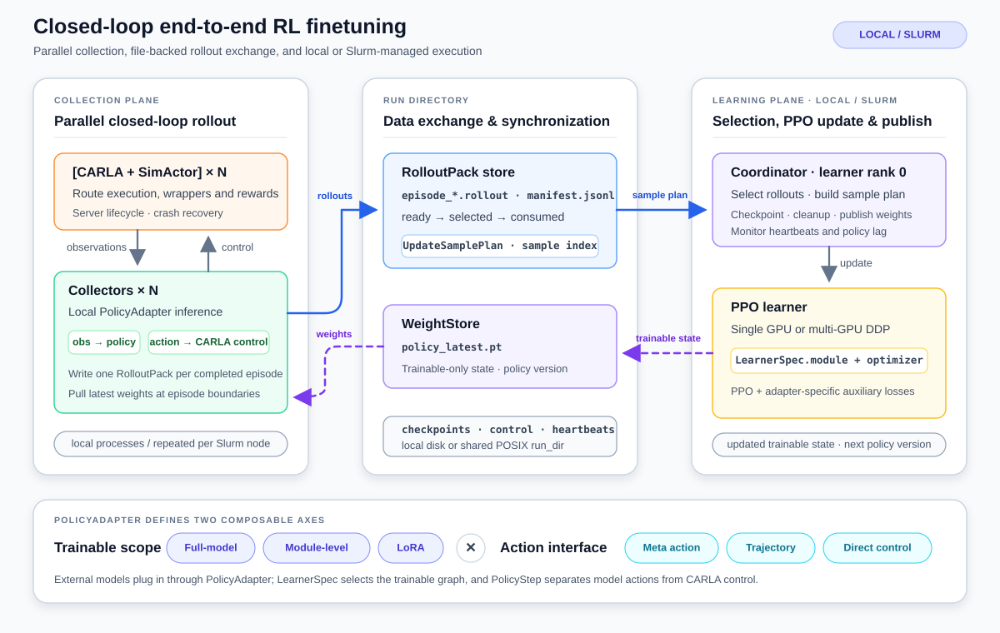

# Finetune Workflow

`b2d_rlinfra.finetuning` provides a framework for finetuning VLA models and other end-to-end driving policies through closed-loop interaction in CARLA. These policies are typically more expensive to finetune online than BEV-observation models because each rollout step may involve RGB camera rendering, vehicle-state or model-specific observation preprocessing, and large-model inference before an action can be applied.

The workflow is built around parallel collectors that each own a CARLA worker and a local inference policy. Collectors continuously generate episode rollouts, recover CARLA workers after crashes, and publish completed rollout files to the learner. The learner updates the policy from those files, writes checkpoints, and republishes fresh weights for the collectors.



This page is the generic workflow reference. It covers the launcher, collector/learner lifecycle, shared config contract, outputs, and adapter boundary. Model-specific setup, external repository dependencies, observation-key details, and exported evaluation checkpoints belong on recipe pages such as [MindDrive Finetune Recipe](rl_finetune_minddrive.md) and [DrivePi0 Finetune Recipe](rl_finetune_drivepi0.md).

Key features include:

- Pluggable `PolicyAdapter` implementations for different end-to-end model types.
- Flexible [finetune modes](#finetune-modes): full-model / module-level / LoRA trainable scopes combined with meta-action / trajectory / direct-control action interfaces.
- Optional multi-GPU DDP learning for distributed runs.
- Managed CARLA server lifecycle and crash recovery for robust sampling.
- Latest-weight synchronization between learner and collectors at episode boundaries.
- Optional TensorBoard summaries for rollout quality, throughput, and update metrics.

## Entry point

Use the finetune launcher under `tools/launch/finetune/`:

```bash
bash tools/launch/finetune/train.sh example
bash tools/launch/finetune/train.sh minddrive
bash tools/launch/finetune/train.sh drivepi0
bash tools/launch/finetune/train.sh /path/to/custom.yaml
```

The aliases resolve to:

| Alias | Purpose | Config |
| --- | --- | --- |
| `example` | Lightweight RGB camera observation finetuning example | `configs/rl_finetune_rgb_example.yaml` |
| `minddrive` | MindDrive finetuning recipe | `configs/minddrive_rl_finetune.yaml` |
| `drivepi0` | DrivePi0 finetuning recipe | `configs/drivepi0_rl_finetune.yaml` |

To run finetuning across Slurm nodes, use the distributed config and launcher described in [Distributed RL Finetune](rl_finetune_distributed.md):

```bash
bash tools/slurm/rl_finetune_sbatch.sh \
  configs/drivepi0_rl_finetune_distributed.yaml
```

For external VLA recipes, place the corresponding upstream repository where the selected YAML expects it, then update the model-specific paths. The model-specific recipe pages provide concrete checklists for paths, dependencies, observations, and exports for `policy_adapter.type: minddrive` and `policy_adapter.type: drivepi0`.

The shell script sets `CARLA_ROOT`, `SCENARIO_RUNNER_ROOT`, `PYTHONPATH`, and `CUDA_VISIBLE_DEVICES`, then launches:

```bash
python -m b2d_rlinfra.finetuning.train --config <config_path>
```

Edit the script and the YAML to match your machine before running. In particular, check the CARLA root, visible CUDA devices, CARLA host/port lists, traffic-manager ports, and UE4 `gpu_id` values.

To initialize a new single-node run from an RL checkpoint:

```bash
bash tools/launch/finetune/train.sh <config_path> \
  --init-from-checkpoint <run_dir>/checkpoints/rl_finetune_update_000010.pt
```

Recovery creates a new run directory and restores the trainable weights, optimizer, updater state, policy version, and next update ID. Keep `policy_adapter.checkpoint` pointed at the base model checkpoint. Distributed recovery uses `tools/slurm/rl_finetune_resume_sbatch.sh`; see the distributed guide for details.

## What the workflow does

For a single-node run, `b2d_rlinfra/finetuning/train.py` loads the same YAML format used by the rest of the repository, then creates a timestamped run directory under `rl_finetune.log_dir`.

The coordinator owns the training loop:

1. Load the initial `PolicyAdapter` using `policy_adapter.type` or `policy_adapter.class_path`.
2. Publish the initial trainable weights through a latest-file weight store.
3. Start one collector process per configured collector.
4. Let collectors run CARLA episodes and atomically write mmap-friendly `.rollout` RolloutPack files.
5. Select ready rollout files for an update.
6. Update the trainable modules from stored rollout tensors and training targets.
7. Save trainable checkpoints and publish the latest trainable weights for collectors.

The training-time path is separate from the baseline `CARLAEnvPool` sampling interface. It reuses the environment factory, wrappers, CARLA worker management concepts, and observation/action handlers, but rollout data flows through files and latest-weight synchronization.

## Finetune modes

The workflow hard-codes neither which parameters are trained nor what kind of action PPO optimizes — both are owned by the `PolicyAdapter`. This gives two independent axes.

**Axis 1 — Trainable scope.** The adapter decides which parameters receive gradients, and checkpoints store only those trainable weights:

| Scope | What is trained | Used by |
| --- | --- | --- |
| Full-model finetune | Every parameter of the policy is trainable. This is practical for small and medium policies that fit comfortably in learner memory. | `tiny_rgb_discrete` |
| Module-level finetune | Selected submodules are fully trained while the large pretrained backbone stays frozen. DrivePi0 trains `action_encoder.*`, `action_decoder.*`, an adapter-created value head; the PaliGemma VLA backbone remains frozen. | `drivepi0` |
| LoRA finetune | Only low-rank adapter weights and task-specific heads are trained. MindDrive updates the decision-expert LoRA weights and `value_net_pro` while leaving the base model untouched. | `minddrive` |

Module-level and LoRA checkpoints therefore stay much smaller than the base model. The model-specific export tools load the base checkpoint, apply the trainable state, and write a checkpoint in the format expected by the upstream evaluation pipeline.

**Axis 2 — Action interface.** PPO can optimize outputs at different levels of the driving stack, matching how the model was pretrained:

| Action interface | Description | Used by |
| --- | --- | --- |
| Meta action | A discrete high-level driving decision. MindDrive samples a meta-action token, then converts that decision into throttle, steer, and brake. PPO optimizes the meta-action distribution rather than the final control values. | `minddrive` |
| Trajectory | A continuous sequence of future ego waypoints. DrivePi0 predicts the trajectory, then the trajectory controller converts those waypoints into low-level controls at each simulator tick. PPO optimizes the waypoint distribution. | `drivepi0` |
| Direct control | Discrete or continuous throttle, steer, and brake commands emitted directly by the policy, as in the RL baselines. | `tiny_rgb_discrete` |

These axes can be combined freely to match a custom pretrained model. In the [adapter contract](#policy_adapter), `LearnerSpec` defines the trainable graph and optimizer, while `PolicyStep.train_action` and `PolicyStep.env_action` separate what PPO learns from what CARLA executes. Adapters can also add model-specific PPO regularization: MindDrive uses an old-policy KL penalty (`ppo.kl_coef`), while DrivePi0 can penalize drift from the reference action mean (`ppo.mean_ref_l2_coef`).

## Main config sections

Finetuning configs keep the existing `algorithm` and `env` sections, and add two workflow-specific sections.

For PPO, `algorithm.batch_size` is the global learner mini-batch. In DDP mode it must be divisible by the learner world size; each learner rank receives a non-overlapping slice. Shard alignment may drop at most `world_size - 1` samples. If a remaining final mini-batch would give each rank less than half its normal local batch (with a two-sample minimum), that small tail is also dropped instead of receiving a full optimizer step or increasing peak memory. All such samples are reported as `dropped_samples`.

### `rl_finetune`

Controls the learner, collectors, rollout selection, checkpoint cadence, and policy synchronization:

```yaml
rl_finetune:
  device: cuda:0
  learner:
    strategy: single
    devices: [cuda:0]
  log_dir: ./logs/minddrive_rl_finetune
  execution_mode: process
  num_collectors: 16
  collector_devices:
    - cuda:0
    - cuda:1
  max_updates: 100
  rollouts_per_update: 32
  collect_timeout: 3600
  control_poll_interval: 1.0
  shutdown_timeout: 120.0
  checkpoint_interval: 1
  max_policy_lag: 2
  stale_rollout_action: drop
  cleanup_stale_rollouts: true
  cleanup_consumed_rollouts: true
  update_sample_filter:
    success_terminal_window_steps: 0
    failure_terminal_window_steps: 200
  policy_sync:
    filename: policy_latest.pt
```

When `collector_devices` is set, it assigns one inference device to each collector by index. In standard process-mode recipes, keep `rl_finetune.num_collectors`, the length of `collector_devices`, and `env.carla.num_envs` aligned so every collector has a matching CARLA worker and inference device.

In distributed mode, learner processes run only on node rank 0. With `learner.strategy: ddp`, learner rank 0 owns rollout selection, checkpointing, weight publication, and TensorBoard, while the remaining learner ranks only participate in training. See [Distributed RL Finetune](rl_finetune_distributed.md) for the multi-GPU configuration.

Every adapter supplies its training module and optimizer through `PolicyAdapter.learner_spec()`. See [Custom Model Integration](rl_finetune_custom_model.md) for the contract.

`update_sample_filter` controls how much of each stored episode enters a PPO update. A window of `0` keeps the whole episode; a positive value keeps only that many final steps. The values above keep successful episodes in full but train on only the last 200 steps of failed or truncated episodes, focusing updates on the transitions that led to the failure.

`max_policy_lag` limits how far a rollout's policy version may trail the learner's current policy version before it is treated as stale. With the default `stale_rollout_action: drop`, stale rollouts are excluded from updates and recorded as `dropped_stale` in `rollouts/manifest.jsonl`; `cleanup_stale_rollouts: true` also removes the stale `.rollout` files.

### `policy_adapter`

Selects the model integration and model-specific adapter settings. The top-level fields identify the adapter and initial checkpoint; the nested `config` block is owned by that adapter, so its fields differ across MindDrive, DrivePi0, and future integrations.

```yaml
policy_adapter:
  type: <adapter_type>
  checkpoint: /abs/path/to/base_model_checkpoint
  config:
    # Adapter-owned settings such as external repository paths,
    # observation keys, precision, trainable components, and PPO extras.
```

The adapter is the boundary between the CARLA rollout system and a model implementation. It owns collection-time inference and trainable-only state publication while hiding model-specific details from the collector and learner. Its `LearnerSpec` exposes the exact training module and optimizer, together with precision, auxiliary-loss weights, and model-specific DDP options used by PPO updates.

Currently used adapter types include:

| Adapter type | Purpose | Trainable scope | Action interface |
| --- | --- | --- | --- |
| `tiny_rgb_discrete` | Lightweight RGB camera smoke-test policy | Full model | Direct discrete control |
| `minddrive` | MindDrive end-to-end policy finetuning | LoRA decision expert plus value head | Meta action plus PID |
| `drivepi0` | DrivePi0 trajectory-policy finetuning | Action encoder/decoder plus value head | Trajectory waypoints |
| custom | Custom adapter loaded from a dotted Python path | Full-model, module-level, or LoRA | Adapter-defined |

Custom models plug in through the same boundary: set `policy_adapter.class_path` to your adapter class instead of `type`. See [Custom Model Integration](rl_finetune_custom_model.md) for the adapter contract and integration checklist.

### `env`

The `env` section is the same environment/wrapper contract used by the baseline training configs. This workflow does not introduce a separate environment schema; E2E recipes reuse the same keys and usually enable additional RGB, model-state, trajectory-action, and model-integration branches. For finetune recipes it commonly controls:

- CARLA worker topology under `env.carla`.
- route files and sampling under `env.routes`.
- RGB camera and model-specific state branches under `env.observation_space`.
- action interface under `env.action_space`.
- reward and termination handlers under `env.reward` and `env.termination`.
- optional model integration wrappers under `env.model_integrations`.

RGB-based finetune recipes require rendering to remain available, so use `render_offscreen: true`, `null_rhi: false`, and `no_rendering_mode: false` unless the recipe explicitly says otherwise.

## Outputs

A single-node run creates a directory like:

```text
logs/<config_name>/rl_finetune_<timestamp>/
```

Important artifacts include:

| Path | Meaning |
| --- | --- |
| `config.yaml` | Resolved run config snapshot |
| `rollouts/manifest.jsonl` | Rollout lifecycle records |
| `rollouts/collector_*/episode_*.rollout` | Per-episode, uncompressed RolloutPack v1 files |
| `rollouts/update_*_sample_plan.json` | Sample-level UpdateSamplePlan selected for an update |
| `weights/policy_latest.pt` | Latest trainable weights for collector sync |
| `checkpoints/rl_finetune_initial.pt` | Initial trainable snapshot before any PPO update |
| `checkpoints/rl_finetune_update_*.pt` | Periodic post-update trainable checkpoints |
| `env_results/` | CARLA route statistics grouped by SimActor lifecycle |
| `crash_events/` | Detailed worker crash records written by SimActor |
| `tensorboard/` | Optional TensorBoard event files |

The shell launcher also writes console logs under:

```text
output/<config_name>/
```

Distributed runs instead collect per-node Slurm output and control metadata inside their shared run directory. See [Distributed RL Finetune](rl_finetune_distributed.md#submit-and-monitor) for that layout.

Model-specific export tools live under `b2d_rlinfra/finetuning/tools/`. Refer to the corresponding recipe page for how to export checkpoints for evaluation.


## Practical checks before launch

- `CARLA_ROOT` points to CARLA 0.9.15.
- `PYTHONPATH` includes the repository, the training runtime, ScenarioRunner, and CARLA PythonAPI.
- For a single-node run, `env.carla.num_envs`, `rl_finetune.num_collectors`, `collector_devices`, and the CARLA slot lists match the intended topology.
- For a distributed run, omit `num_envs` and `num_collectors`, keep the repository and run directory on shared storage, and follow the node-local topology rules in the distributed guide.
- `policy_adapter.checkpoint` and model-specific paths are real paths on the machine.
- For external VLA recipes, the corresponding model repository is available where the YAML expects it.
- RGB camera observation keys and model-specific state keys match the adapter config.
- For first debugging, lower `num_collectors`, `env.carla.num_envs`, `max_updates`, `rollouts_per_update`, and `env.environment.max_episode_steps`.

## Related modules

- `b2d_rlinfra/finetuning/train.py`
- `b2d_rlinfra/finetuning/coordinator.py`
- `b2d_rlinfra/finetuning/collector.py`
- `b2d_rlinfra/finetuning/policy_adapter.py`
- `b2d_rlinfra/finetuning/minddrive_policy_adapter.py`
- `b2d_rlinfra/finetuning/drivepi0_policy_adapter.py`
- `b2d_rlinfra/finetuning/learner_distributed.py`
- `b2d_rlinfra/finetuning/rollout_file_store.py`
- `b2d_rlinfra/finetuning/rollout_file_dataset.py`
- `b2d_rlinfra/finetuning/rollout_pack.py`
