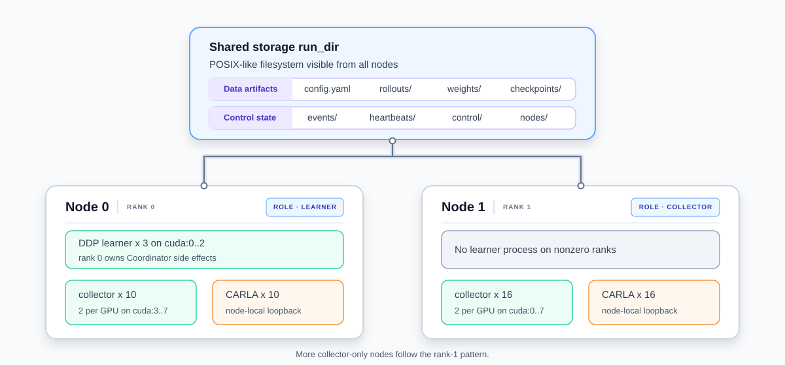

# Distributed RL Finetune

The distributed finetuning workflow runs end-to-end rollouts and policy updates across multiple Slurm nodes. It is useful when CARLA rendering and policy inference make a single node the training bottleneck.

Read [Finetune Workflow](rl_finetune.md) for the shared learner, collector, rollout, and adapter concepts. This page only covers the multi-node runtime.

## Requirements

- A Linux cluster managed by Slurm. The launcher starts one `node_agent` task on each allocated node.
- A shared POSIX-like filesystem mounted at the same path on every node. It must provide atomic rename within a directory and timely cross-node visibility. GPFS, Lustre, and BeeGFS are expected to provide the required semantics.
- The repository, config, model files, and run directory must be accessible from every node. CARLA may be shared or installed node-locally, but it must use the same path on all nodes.
- The Python environment, CARLA 0.9.15 dependencies, and `tools/fake_bind.so` described in the [Setup Guide](start_setup.md), plus any model-specific dependencies.
- A working NVIDIA driver, `nvidia-smi`, the NVIDIA Vulkan ICD, and a loadable `libvulkan.so.1` on every CARLA node.

## Architecture



The diagram shows the two-node DrivePi0 example; node and collector counts are configurable.

Each node runs one `node_agent`:

- Node rank 0 starts all learner processes and its local collectors.
- Other node ranks start collectors only.
- Every collector starts a node-local CARLA server and writes rollouts to the shared run directory.

All cross-node coordination uses atomic files in the shared run directory, including events, heartbeats, run state, rollouts, and policy weights. No separate coordination service is required.

## Configuration

Start from `configs/drivepi0_rl_finetune_distributed.yaml`, then update model paths, CARLA slots, and topology for the target cluster.

### Collector topology

```yaml
algorithm:
  batch_size: 144  # global batch: 48 x 3 learner ranks

rl_finetune:
  device: cuda:0
  learner:
    strategy: ddp
    devices: [cuda:0, cuda:1, cuda:2]
    backend: nccl
    timeout_seconds: 3600.0
  rollouts_per_update: 26
  collect_timeout: 3600
  control_poll_interval: 1.0
  shutdown_timeout: 180.0
  max_policy_lag: 2
  stale_rollout_action: drop
  cleanup_stale_rollouts: true
  cleanup_consumed_rollouts: true
  keep_last_n_update_rollouts: 0
  distributed:
    enabled: true
    num_nodes: 2
    collectors_per_node: 16
    learner_node_collectors: 10
    startup_timeout: 1800.0
    heartbeat_interval: 10.0
    heartbeat_timeout: 3600.0
    stagger_seconds: 10.0
    cuda_vulkan_identity_fallback: true
```

`learner.strategy: ddp` requires distributed mode, at least two explicit CUDA devices, and an `algorithm.batch_size` divisible by the number of learner devices. `collectors_per_node` may be one integer for a uniform topology or a list with one value per node. `learner_node_collectors` overrides the collector count on node rank 0. Learner devices are interpreted only on node rank 0.

Collector count is derived from the distributed topology, so a distributed config must not set the single-node fields `rl_finetune.num_collectors`, `env.carla.num_envs`, `rl_finetune.rollout_dir`, or `rl_finetune.weight_dir`.

`min_active_collectors` defaults to two thirds of the planned collectors, rounded up. Set it explicitly if the run should tolerate a different number of lost collectors.

We recommend setting `rollouts_per_update` close to the number of active collectors. Lower values increase policy lag for queued rollouts; higher values make the learner wait for more rollouts and consume more memory per update.

### Node-local devices and CARLA slots

With DDP, set `collector_devices` explicitly. Device and CARLA slot lists are node-local: entry `i` configures collector local ID `i` on every node. Their length must cover the largest collector count on one node—16 in this example.

```yaml
rl_finetune:
  collector_devices:
    [cuda:3, cuda:3, cuda:4, cuda:4, cuda:5, cuda:5, cuda:6, cuda:6,
     cuda:7, cuda:7, cuda:0, cuda:0, cuda:1, cuda:1, cuda:2, cuda:2]
```

Node rank 0 uses the first 10 entries, leaving `cuda:0`–`cuda:2` for its learner ranks; node rank 1 uses all 16 entries. The `env.carla.host`, `port`, `traffic_manager_port`, and `traffic_manager_seed` lists follow the same indexing and also need 16 entries. See the runnable config for the complete slot lists.

### Policy lag

Collectors synchronize weights at episode boundaries, so some completed rollouts may use an older policy version. A rollout more than `max_policy_lag` versions behind the learner is recorded as `dropped_stale` in `rollouts/manifest.jsonl` and excluded from training.

Keep both cleanup options enabled: `cleanup_stale_rollouts` removes stale rollouts, while `cleanup_consumed_rollouts` removes rollouts after training consumes them.

## Prepare the Slurm launcher

Before the first submission, edit the `USER SETTINGS` sections in `tools/slurm/rl_finetune_sbatch.sh`:

| Setting | Purpose |
| --- | --- |
| `CONDA_ENV_PREFIX` | Absolute path to the Python environment used on every node |
| `CARLA_ROOT_VALUE` | CARLA installation path used on every node |
| `VULKAN_LIB_DIR_VALUE` | Optional directory containing `libvulkan.so.1` and, preferably, `vulkaninfo` |
| `VK_ICD_VALUE` | NVIDIA ICD JSON path |
| `PARTITION`, `NODES`, `GRES`, `CPUS`, `MEM`, `TIME_LIMIT` | Cluster resource request |

Apply the same environment and resource settings to `tools/slurm/rl_finetune_resume_sbatch.sh` before using checkpoint recovery. `node_entry.sh` normally needs no edits; customize it only when the cluster requires module-loading or another site-specific setup step.

The launcher's `NODES` value must match `rl_finetune.distributed.num_nodes` in the YAML.

### Vulkan runtime and GPU mapping

CARLA requires a Vulkan loader for Unreal Engine rendering. If `libvulkan.so.1` is not installed system-wide on compute nodes, provide a compatible loader directory through `VULKAN_LIB_DIR_VALUE`.

`vulkaninfo` is recommended because `gpu_id: auto` can then align CUDA and Vulkan devices by UUID, with PCI bus ID as a fallback. If `vulkaninfo` is unavailable, identity mapping is allowed only when all of these checks pass:

- `VK_ICD_FILENAMES` selects only the NVIDIA ICD.
- `CUDA_VISIBLE_DEVICES` is the literal contiguous list `0,1,...,N-1`.
- `nvidia-smi` reports a homogeneous set of NVIDIA GPUs.
- `distributed.cuda_vulkan_identity_fallback` is enabled.

Do not assume that a CUDA index is always the same as UE4's Vulkan `-graphicsadapter` index. Software adapters such as `llvmpipe` can shift the Vulkan numbering. If automatic mapping cannot be proven safe, preflight fails before collectors start; either provide `vulkaninfo` or set a verified node-local `env.carla.gpu_id` list.

You can inspect mapping independently inside an allocation:

```bash
export VK_ICD_FILENAMES=/usr/share/vulkan/icd.d/nvidia_icd.json
PYTHONPATH="$PWD" \
  python -m b2d_rlinfra.finetuning.gpu_mapping --json
```

## Submit and monitor

### Submit a run

Start a new run with:

```bash
bash tools/slurm/rl_finetune_sbatch.sh \
  configs/drivepi0_rl_finetune_distributed.yaml
```

To resume from a finetuning checkpoint, pass a checkpoint path that is visible at the same path on every allocated node:

```bash
bash tools/slurm/rl_finetune_resume_sbatch.sh \
  configs/drivepi0_rl_finetune_distributed.yaml \
  <old_run_dir>/checkpoints/rl_finetune_update_000010.pt
```

Both launchers create a new run directory. New runs use `logs/<config_stem>/rl_finetune_<timestamp>_<job_id>/`; resumed runs use `logs/<config_stem>/rl_finetune_resume_<timestamp>_<job_id>/`. The resume launcher does not reuse control or rollout files from the previous run.

### Monitor a run

All nodes must pass preflight before any collector starts. Per-node diagnostics are written to `nodes/node_<node_rank>.json`; they include the resolved collector slots and CUDA-to-Vulkan mapping.

Useful checks are:

```bash
squeue -j <job_id>
tail -f <run_dir>/logs/nodes/node_0.out
python -m json.tool <run_dir>/control/run_state.json
python -m json.tool <run_dir>/nodes/node_000.json
python -m json.tool <run_dir>/weights/latest.json
tensorboard --logdir <run_dir>/tensorboard
```

The main run artifacts are:

| Path | Meaning |
| --- | --- |
| `config.yaml` | Normalized run config |
| `topology_resolved.json` | Global node, learner, and collector plan |
| `nodes/node_<node_rank>.json` | Per-node preflight and GPU mapping diagnostics; the node rank is zero-padded |
| `control/run_state.json` | `starting`, `running`, `stopping`, `finished`, or `failed` |
| `control/learner_heartbeat.json` | Coordinator learner heartbeat |
| `heartbeats/` | Node and collector liveness files |
| `events/collector_*/` | Rollout and crash notifications |
| `rollouts/` | Rollout files, manifest, and update sample plans |
| `weights/` | Latest policy publication for collectors |
| `checkpoints/` | Recoverable RL checkpoints |
| `env_results/` | CARLA route statistics grouped by SimActor lifecycle |
| `crash_events/` | Detailed worker crash records written by SimActor |
| `logs/nodes/` | Per-node Slurm output |

## Stop and clean up

Use normal Slurm cancellation first so each `node_agent` can stop its collectors and clean node-local CARLA and shared-memory resources:

```bash
scancel <job_id>
```

If a job was force-killed or a node exited before cleanup, use the run-scoped cleanup helper. It is a dry run unless `--force` is supplied:

```bash
bash tools/slurm/cleanup_rl_finetune_job.sh \
  --job-id <job_id> --run-dir <run_dir>

bash tools/slurm/cleanup_rl_finetune_job.sh \
  --job-id <job_id> --run-dir <run_dir> --force
```

The helper targets only processes and RGB shared-memory files tagged for that run. If node discovery is unavailable after the job has left Slurm accounting, pass `--nodelist` explicitly.

## Troubleshooting

| Symptom | Check |
| --- | --- |
| A node remains in preflight or the run becomes `failed` | Read `nodes/node_<node_rank>.json` and that node's log first. Confirm `num_nodes` matches the Slurm allocation and all shared paths exist. |
| `libvulkan.so.1` cannot be loaded | Install the Vulkan loader on compute nodes or set `VULKAN_LIB_DIR_VALUE` to a compatible loader directory. |
| CUDA-to-Vulkan mapping is refused | Restrict `VK_ICD_FILENAMES` to the NVIDIA ICD, provide `vulkaninfo`, or configure a verified node-local `gpu_id` list. |
| CARLA starts but `load_world` times out | Check the resolved adapter, allow more time for a cold Derived Data Cache, and increase CARLA startup/load-world timeouts if needed. A listening port alone does not prove rendering is healthy. |
| Startup is slow | Large models load once per collector. Tune `stagger_seconds` to balance startup time against shared-filesystem and CPU pressure. |
| The learner reaches `collect_timeout` | Inspect collector heartbeats, node logs, and stale entries in `rollouts/manifest.jsonl`; the learner only updates after enough fresh rollouts are ready. |
| Processes remain after cancellation | Run the cleanup helper in dry-run mode, review its targets, then repeat with `--force`. |
